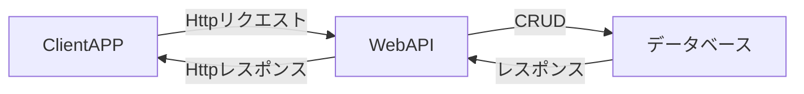
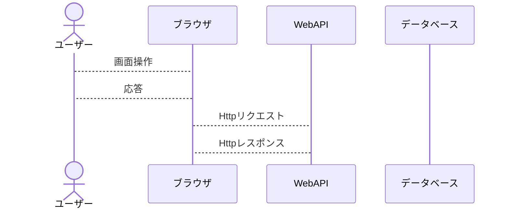
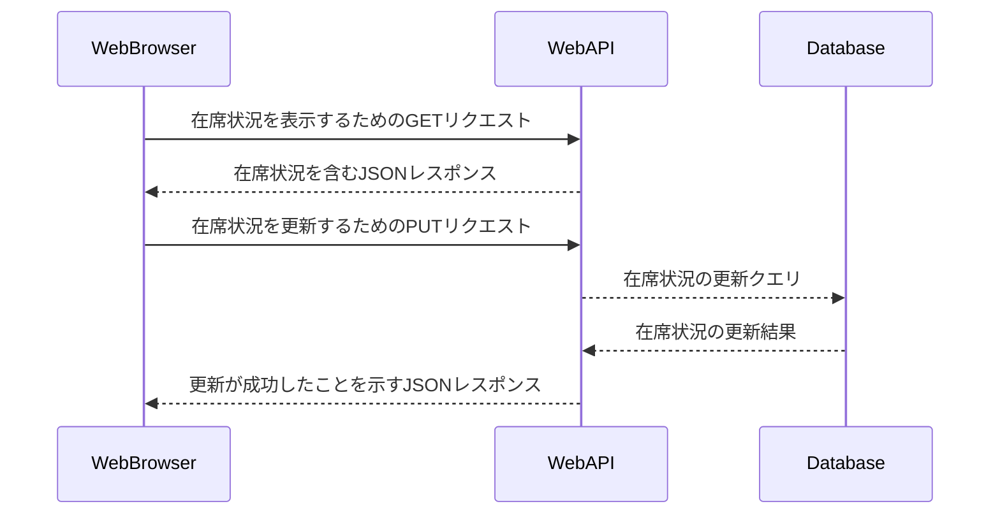
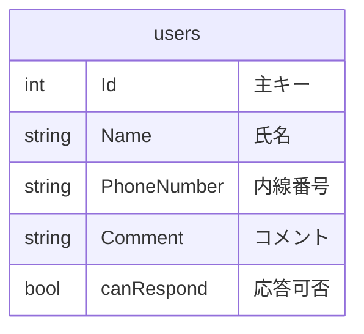

# 在席管理システムについて  

## 概要  

ウェブ上に職員の現在の在席状況を表示するものである。  
在席・退席中の表示についてはウェブ上でボタンをクリックすることで行う。  
また現状についてのコメントを記載出来る機能がある。

```mermaid
flowchart LR
ClientAPP -->|Httpリクエスト| WebAPI
WebAPI -->|Httpレスポンス| ClientAPP
データベース -->|レスポンス| WebAPI
WebAPI -->|CRUD| データベース


```

```mermaid
sequenceDiagram
    actor ユーザー
    participant ブラウザ
    participant WebAPI
    participant データベース
    ユーザー-->ブラウザ:画面操作
    ブラウザ-->ユーザー:応答
    ブラウザ-->WebAPI:Httpリクエスト
    WebAPI-->ブラウザ:Httpレスポンス

```

```mermaid
sequenceDiagram
    participant WebBrowser
    participant WebAPI
    participant Database

    WebBrowser->>WebAPI: 在席状況を表示するためのGETリクエスト
    WebAPI-->>WebBrowser: 在席状況を含むJSONレスポンス

    WebBrowser->>WebAPI: 在席状況を更新するためのPUTリクエスト
    WebAPI-->>Database: 在席状況の更新クエリ
    Database-->>WebAPI: 在席状況の更新結果
    WebAPI-->>WebBrowser: 更新が成功したことを示すJSONレスポンス

```

## DBについて  

MicrosoftのSQLServerを使用し、以下のテーブルを作成する。  

```mermaid
erDiagram

users {
    int Id "主キー"
    string Name "氏名"
    string PhoneNumber "内線番号"
    string Comment "コメント"
    bool canRespond "応答可否"
}

```
